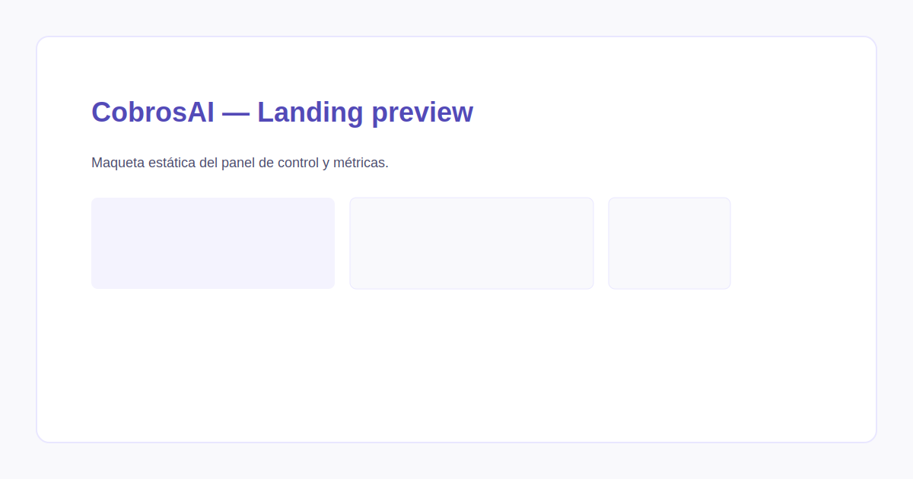

<p align="center">[](https://github.com/yospinamurillo/CobrosAI/actions/workflows/ci-pages.yml) [](https://github.com/yospinamurillo/CobrosAI/blob/main/LICENSE) [](https://github.com/yospinamurillo/CobrosAI/issues) [](https://github.com/yospinamurillo/CobrosAI/pulls) [](https://github.com/yospinamurillo/CobrosAI/commits) [](https://github.com/yospinamurillo/CobrosAI)</p>

# CobrosAI

**CobrosAI** es una maqueta estática de la página de aterrizaje (landing page) para un producto que automatiza y mejora la gestión de cobros usando inteligencia artificial.

Visita el archivo principal: `cobrosai-landing.html` para ver el diseño.

Demo local

Para ver la landing localmente:

```bash
# desde la carpeta del repo
python -m http.server 8000
# abre http://localhost:8000/cobrosai-landing.html
```

GitHub Pages

Este repositorio incluye un workflow de GitHub Actions que valida HTML y enlaces y despliega automáticamente a GitHub Pages cuando se hace push a `main`.

- Sitio (cuando esté desplegado): https://yospinamurillo.github.io/CobrosAI/

Capturas (placeholder)



Contenido del repositorio

- `index.html` — redirección a la landing.
- `cobrosai-landing.html` — HTML con la landing.
- `styles.css` — CSS extraído desde el HTML para facilitar edición.
- `README.md` — este archivo (ES / EN).
- `LICENSE` — licencia MIT.
- `CONTRIBUTING.md` — guía para contribuir.
- `screenshots/preview.svg` — placeholder de captura de pantalla.
- `.github/workflows/ci-pages.yml` — workflow que valida y despliega a Pages.

Cómo contribuir

1. Haz fork del repositorio.
2. Crea una rama nueva: `git checkout -b feat/nombre-cambio`.
3. Haz tus cambios y commitea con mensajes claros.
4. Abre un Pull Request describiendo los cambios.

Si planeas cambios técnicos (API, integraciones), abre antes un issue para discutir el diseño.

Licencia

Este proyecto se publica bajo la licencia MIT. Consulta el archivo `LICENSE`.

Contacto

Para consultas o demo: `hola@cobrosai.co`

---

EN — English version

# CobrosAI

CobrosAI is a static landing page mockup for a product that automates invoice collection using AI. This repository contains the HTML and CSS for the landing page and simple workflow notes to help you [...]

Preview

Open `cobrosai-landing.html` in your browser or run a local static server (see commands above).

CI & Deployment

This repo runs a GitHub Actions workflow to validate HTML and check for broken links, then deploys the static files to GitHub Pages on pushes to `main`.

License

MIT — see `LICENSE` for full text.
